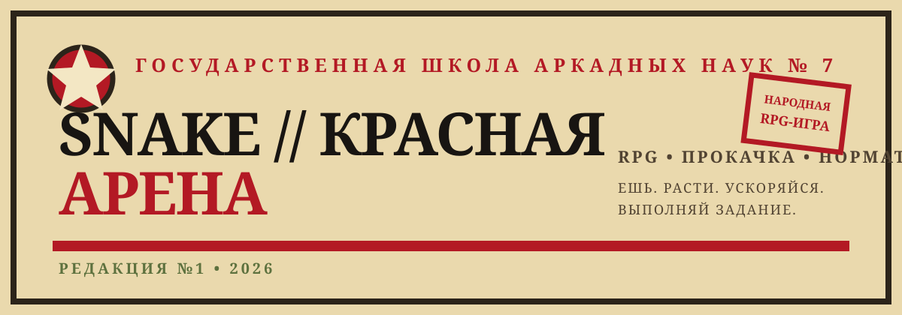

# ★ SNAKE // КРАСНАЯ АРЕНА



> Советская аркадная RPG-змейка в одном HTML-файле. Ешь энергокристаллы, повышай квалификацию, модернизируй машину и выполняй норматив.

## Витрина проекта

**Аркада** — классическая змейка с короткими сессиями.

**RPG** — опыт, уровни, звания и коэффициент XP.

**Модернизация** — Форсаж, Ускоритель и Броня с растущей стоимостью.

**Экономика** — энергокристаллы за еду и дополнительные XP-кристаллы.

**Сохранение** — прогресс хранится локально и продолжает жить между запусками.

## Что уже работает

- **Уровни и XP:** за прохождение смены и сбор кристаллов.
- **Скорость:** базовый темп змейки можно повышать в цехе модернизации.
- **Ускорение:** отдельная характеристика усиливает рост темпа по ходу серии.
- **Броня:** запас на столкновение для более длинных забегов.
- **Рейтинг забега:** очки, длина и текущая скорость отображаются прямо под ареной.
- **Мобильное управление:** сенсорные свайпы плюс клавиатурное управление.
- **Один файл:** никаких npm, сборщика или внешних библиотек.

## Запуск

Откройте `index.html` в браузере.

Для публикации через GitHub Pages используйте `index.html` в корне репозитория и ветку `main` в настройках Pages.

## Структура

```text
.
├── index.html
├── README.md
└── assets/
    └── arena-poster.svg
```

## Игровая модель

Уровень повышается за XP. Порог следующего уровня растёт постепенно: `100 + (уровень - 1) × 60`.

В цехе модернизации три направления:

| Модернизация | Эффект |
|---|---|
| **Форсаж** | уменьшает базовый интервал шага и делает змейку быстрее |
| **Ускоритель** | усиливает динамическое ускорение во время длинного забега |
| **Броня** | увеличивает запас на столкновения |

Есть обычные энергокристаллы и редкие XP-кристаллы. Стоимость улучшений растёт с каждым уровнем, поэтому развитие постепенно становится осознанным выбором.

## Планы следующей редакции

Следующий шаг — превратить локальную RPG в Twitch-платформу: Twitch OAuth, постоянный профиль пользователя, серверная база, таблица лидеров канала, сезоны и затем единая архитектура для боевой арены с автоматическими PvP-боями зрителей.

## Лицензия

Прототип предназначен для дальнейшей разработки. Лицензия публичного релиза будет определена отдельно.

---

**SNAKE // КРАСНАЯ АРЕНА** · Редакция №1 · `runelian/-`
